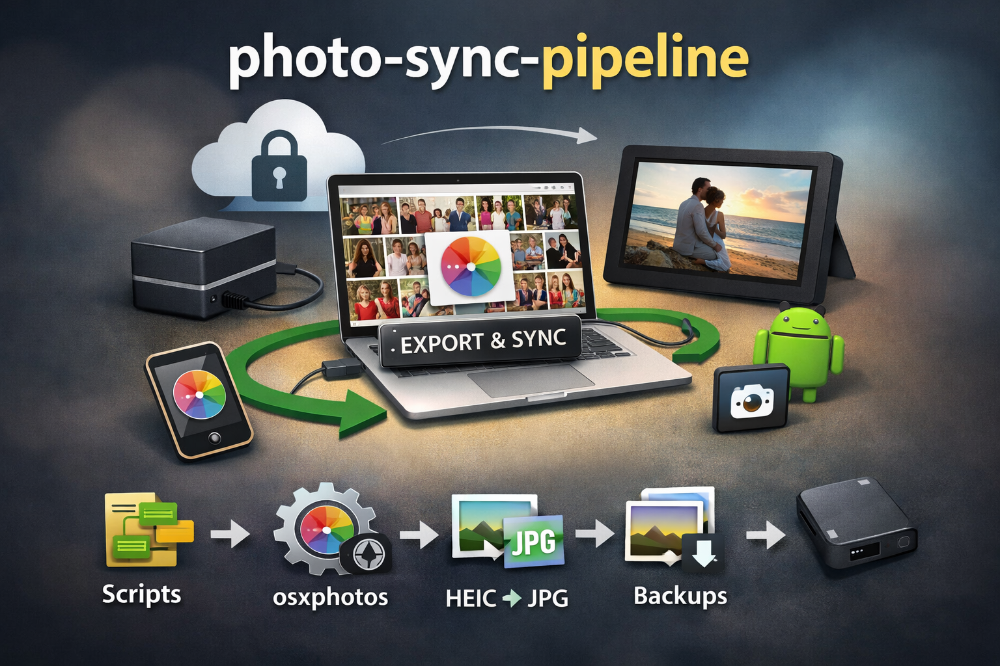

# photo-sync-pipeline



A small, repo-contained pipeline to manage photos outside iCloud:

- Export photos and videos from **Apple Photos** to a local folder for long-term archival
- Export a curated album to an **Android digital frame (Fotoo)** via ADB over Wi-Fi
- Normalize formats (HEIC → JPG), resize, compress
- Trigger MediaStore scan and restart Fotoo
- Clear the curated album after transfer
- Run backups to external drives

This is a pragmatic, repeatable workflow built around **ownership of your photo files**.

## A replacement for Dropbox “Camera Uploads”

This pipeline also works well as a replacement for Dropbox’s **Camera Uploads** feature.

If you are migrating away from Dropbox (for example, to Proton Drive), one of the most commonly missed features is:

> Automatic, local-first access to camera photos as real files.

Apple Photos already provides the capture and sync layer, but it does not expose photos as files in a predictable way, and many alternative cloud drives do not offer an equivalent to Camera Uploads.

This project fills that gap by:

- Exporting photos from Apple Photos into real directories on disk
- Using deterministic filenames and paths
- Making the filesystem the long-term source of truth
- Keeping cloud storage optional, not required

The result is functionally similar to Camera Uploads, but with:

- Explicit control
- Better backups
- No dependency on a single vendor

Apple Photos remains the capture and curation interface.  
The filesystem replaces Dropbox as the archive.

## Why this project exists

Modern photo workflows are fragmented by design.

Phones upload to cloud services, photos live inside opaque libraries, digital frames want folders of JPEGs, backups want deterministic paths, and every tool assumes it owns the whole pipeline.

Each individual tool works well in isolation, but none of them solve the real problem:

Ownership and control of photos as files.

This project exists to deliberately connect those tools into a single, repeatable pipeline that puts the filesystem back at the center.

## The core idea

Apple Photos is excellent as a working interface:

- Capture and sync from devices
- Deduplication
- Face recognition
- Curation and selection
- Albums as intent

But it is a poor long-term storage format:

- Originals are hidden inside a database bundle
- Exports are manual and inconsistent
- It does not integrate cleanly with non-Apple devices

Instead of replacing Apple Photos, this pipeline treats it as a temporary workspace, not the archive.

The filesystem is the archive.

## What the pipeline does

This project stitches together several small, well-defined tools, each used for what it does best:

- Apple Photos:
Used for selection, curation, and intent (albums), not storage.
- osxphotos:
Extracts originals from the Photos database into real files with deterministic names and paths.
- Image normalization (sips + helpers):
Converts HEIC to JPG, resizes and compresses images to device-friendly formats.
- ADB (Android Debug Bridge):
Automates transfer to an Android digital frame, triggers media scans, and restarts the Fotoo app.
- Albums as signals:
The “Digital frame” album is not storage.
It is a signal: “these photos should be sent to the frame.”
Once consumed, the album is cleared.
- rsync + external drives:
Filesystem-first backups that are transparent, inspectable, and vendor-independent.

## The result

- Photos remain easy to manage and curate
- Originals exist as real files, outside any vendor lock-in
- Digital frames are updated automatically
- Backups are boring and reliable
- No step depends on a proprietary cloud being “up”

The pipeline favors explicit steps, boring tools, and repeatability over convenience abstractions.

Cloud sync is treated as a convenience.

Backups are treated as a responsibility.

---

## Requirements

### macOS

- Apple **Photos** app
- Photos app set to download originals (not "Optimize Mac Storage")
- `osxphotos` CLI

### Android

- `adb` (Android Platform Tools)
- Tablet with **Developer options** enabled
- **Wireless debugging** enabled
- **Fotoo** installed

---

## Configuration

1. Edit the `config.sh` file in the repository root.
2. Install the required dependencies: `make deps`
3. Run this to install the symlinks: `make install`

---

## Photos organization (Weekly flow)

Here's what I do weekly for backing up my photos as physical files and also sending them to the Digital frame:

- Check for duplicates using the duplicates tool in the Photos app and delete them
- Let iCloud resync (open the Photos app on Macbook and check the sync status)
- Run the export photos script with the date after I last ran the sync: `export-photos-since 2026-01-25`
- Move physical files to the correct directories for backup
- Remove photos from the Photos app, leaving only the ones I choose from each group of photos
- Select which photos in the Photos app will go to the Digital frame, by adding them to the Digital frame album in the Photos app
- Remember to connect the backup hard-drives to the Macbook
- Finish the process by running the script: `export-digital-frame`

---

## Usage

### Export photos & videos since a date (archive)

```bash
export-photos-since 2026-01-25
```

Exports from Apple Photos starting at the given date into `CAMERA_UPLOADS_DIR`.

---

### Export curated “Digital frame” album

```bash
export-digital-frame
```

Pipeline steps:

1. Export the **Digital frame** album to `DIGITAL_FRAME_DIR`
2. Normalize extensions
3. Resize and compress JPGs
4. Convert HEIC → JPG
5. Push photos to Android via ADB (Wi-Fi)
6. Trigger MediaStore scan
7. Restart Fotoo
8. Clear the Photos album
9. Run backups

---

## Safety notes

- The digital-frame export only deletes `*.jpg` / `*.jpeg` inside `DIGITAL_FRAME_DIR`
- Clearing the album removes items from the album only (not from the library)
- Backup scripts use `rsync`; review them before first use

---

## Makefile shortcuts

```bash
make deps
make install
make digital-frame
make export-since DATE=2026-01-25
make backups
```

---

## Philosophy

This project deliberately avoids:

- cloud-only photo ownership
- opaque vendor pipelines
- manual, error-prone weekly work

It is designed to be:

- explicit
- inspectable
- boring in the best way
